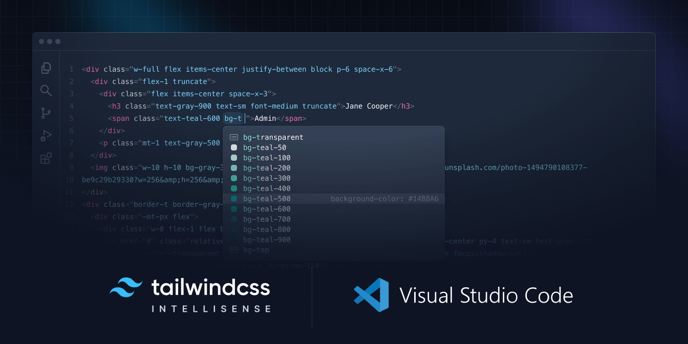

# P5: Frontend

**Assigned**: March 29

**Due**: April 5, 11:59 PM

**Late Deadline**: April 7, 11:59 PM

## Description
Improve Project 2 by adding styles and interactivity to the website. You can use either CSS or Tailwind for styling and JavaScript or any JS framework (choose from: React, Svelte, Solid, Vue) for interactivity.

## Setup
Once you have a virtual environment, activate it,
use the appropriate command for your system.
Then, to install the necessary packages, navigate to
`p5/` and run `pip3 install -r requirements.txt`.

Alternatively: `pip3 install Flask requests python-dotenv`.

To use Tailwind without a Play CDN or any JS Framework for the project, you will need to [download Node.js](https://nodejs.org/en/download/).

## Project

### Part 1: Styling

#### Setup:
You can use either CSS or Tailwind for styling. If you choose to use Tailwind, you can use the [Play CDN](https://tailwindcss.com/docs/installation/play-cdn) or [install Tailwind CLI it with npm](https://tailwindcss.com/docs/installation).

To use the **CDN**, no installation is needed, just put the CDN `<link>` in your `base.html`.

For **Tailwind CLI** the correct `tailwind.config.js` has already been provided, you will need to create an `input.css` file in the `static/` directory and run the provided `./tw.sh` to generate a "compiled" `custom.css` file (which is linked in your `base.html` by default).

> [!CAUTION]
> If you started by writing your styles in CSS and then decided to switch to Tailwind, make sure to copy the progress you've made into the newly created `input.css` before running `/tw.sh`, as that will override the `custom.css` file.

To see your styles update in real time as you're editing them, update your flask version by running `pip install --upgrade flask`
and then run `./tw.sh` in the terminal. This will start the Tailwind CSS compiler. Then run `flask run --debug` in another terminal, the `--debug` flag will allow you to see any styling changes you've made by simply refreshing the page, without restarting the Flask server.

> [!NOTE]
> if something with your setup doesn't work, make sure you are running both the provided `./tw.sh` script the flask server in `--debug` mode at the same time.

> [!TIP]
> you can install a VSCode extension for [Tailwind CSS IntelliSense](https://marketplace.visualstudio.com/items?itemName=bradlc.vscode-tailwindcss) to get suggestions for Tailwind classes as you type them out.

#### Requirements:
  There are no strict rules on how you should style your pages, but there are some minimum requirements:
  - You must add at least some styles to all 3 pages.
  - You must use at least one flexbox or grid on the site.
  - You center at least one element using one of four methods we went over in class (margin auto, position + translate, flexbox, grid).
  - You must use at least one `position: sticky` and one `position: absolute` or `position: fixed` for some element on the site.
  - All 3 pages should be viewable on a small mobile screen. This won't be graded very harshly, but try your best :)
  > [!TIP]
  > For the last one, don't set a fixed width on any elements, use percentages or `vw` units instead, or set a min-width instead.

You cannot submit the styles directly copied from the [Sample Site](https://p5.aspear.cs.umd.edu/), but you can copy and edit them to be different enough so that we don't notice.

Feel free to consult the week7 lecture examples, a friend, ChatGPT, or the internet to help you with any of this.

Although not required, you can also add animations, transitions, or any other feature that you think will improve the user experience, be creative!

### Part 2: Interactivity
You can use plain JavaScript or any JS framework (React, Svelte, Solid, Vue) for interactivity. If you choose to use a JS framework, you will need to install it.

Go to the [React](https://reactjs.org/docs/create-a-new-react-app.html#create-react-app) or [Svelte](https://svelte.dev/docs#svelte) documentation to see how to install them.

Run the npm commands from inside the `static/` directory.

For this part, you choose what you want to add to your website. You can add a toggle, a search bar, a filter, a modal, a carousel, etc.

Here are some ideas:
- A search bar that filters the list of Pokemon by name (you are not allowed to copy the code from the Sample Site, but you can recreate it if you're using a framework)
- A sort button that sorts the Pokemon alphabetically by name
- A filter for Pokemon's moves on the Pokemon info page
- A carousel that shows images of Pokemon
- A theme toggle:

 - https://github.com/AndersSpear/388jprivate/assets/31113245/9b3d9e28-4ffc-4fcc-8048-eab919b4a1ed

- Add a toggle that switches between a list and a grid view of Pokemon:

 - https://github.com/AndersSpear/388jprivate/assets/31113245/ba8f5ef2-04d0-4e3b-95e9-97a9343a774e

## Grading

| Requirement                                                                                                           | Points           |
| --------------------------------------------------------------------------------------------------------------------- | ---------------- |
| All 3 pages are styled                                                                                                | 30, (10 for each)|
| At least 1 flexbox or grid is used                                                                                    | 10               |
| At least 1 element is centered on the screen                                                                          | 10               |
| At least 1 position: sticky and 1 position: absolute or fixed was used                                                | 10               |
| All 3 pages are mobile responsive (all links are clearly visible on screens as little as 300px wide)                  | 10               | (70 total for styling)
| There exists a toggle or an input on the page that provides functionality for the user without a page refresh         | 30               |
| A JavaScript framework was used                                                                                       | 10 extra         |

The project will be graded out of a 100 points.

> [!IMPORTANT]  
> 10 extra points for using a framework can recover any points lost in other parts, but they are not extra credit on top of 100 points.
